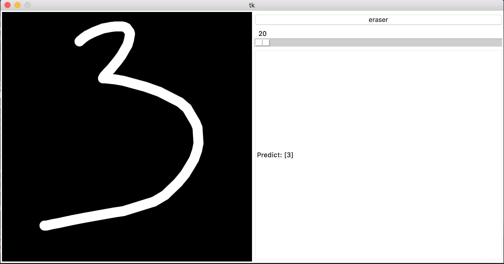

# nc-tensorflow-learning

### Libs:
```
pip install scikit-image
pip install pyscreenshot
```


For Tkinter on ubuntu
```
sudo apt-get install python-tk
python -m Tkinter
```


### Run: 
```
PYTHONPATH="${PYTHONPATH}:$(pwd)" python src/mnist/painter.py
```


I tested with image 0 & 1 from mnist original data extraction; 3 & 5 were not in training/testing dataset



